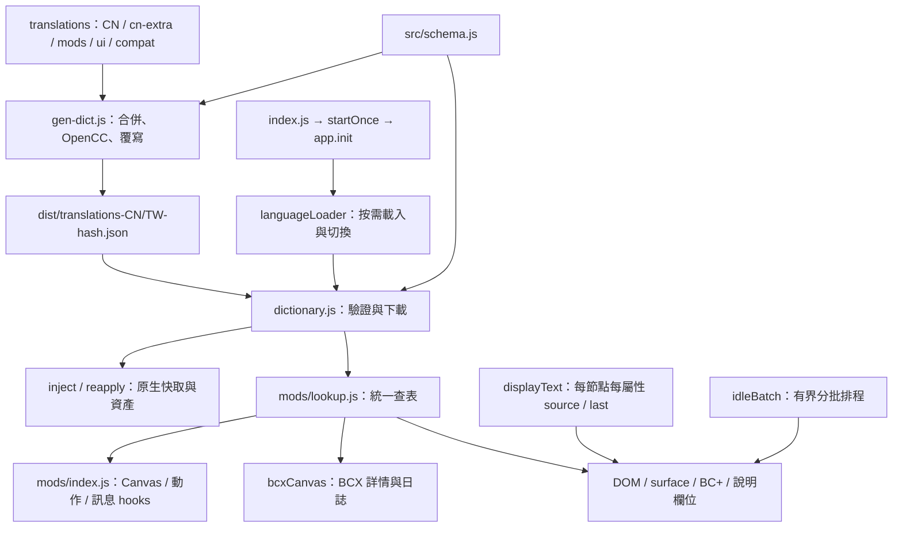

# BC Translation Patch 架構檢視

更新日期：2026-09-25。本文描述目前實作與本次收斂結果，取代 2026-09-12 的建議清單。互動導覽見 [architecture.html](architecture.html)。

## 執行與資料流程

入口 JS 先建立 BCTP 狀態，再按遊戲選擇只下載 CN 或 TW 字庫；非中文不下載。執行期間切換語言由既有 readiness watcher 通知 languageLoader，不新增輪詢器。同一語言合併並行請求，成功後保留記憶體快取；過時回應不觸發重畫。下載本文有 180 秒預算，遊戲函式就緒另有 30 秒預算；成功下載後才注入快取與註冊 hooks。初始化失敗由 scope 清除已註冊資源；快取注入保留，重試可沿用字庫。

建置與執行期共同使用 `src/schema.js` 的欄位契約：paths、surfaces、activity、modRegex、bcxHelp、crafting、base、modMenu、compat。gen 與 build 共用 serializer；開發用 dict.json 保留完整雙語資料；發布分別輸出 CN/TW，建置後檢查每份 JSON 內容、hash 與入口網址一致，並測試兩份合併可還原完整字庫。舊 hash JSON 必須保留，供 PCM 快取舊入口使用。

## 本次完成的收斂

| 項目 | 處理與證據 |
| --- | --- |
| 舊字典與執行碼混在一起 | 原 BCX／LSCG 字典、supplement、HTML 說明遷到 `translations/compat.json`；移除 11 個舊 JS 字典／wrapper／啟用判斷檔。保留 ECHO 來源與原有匹配順序，資料在建置時產生 CN/TW。 |
| 多套查表 | `mods/lookup.js` 集中 menu、activity、DOM、crafting、HTML 查表；`mods/index.js` 只負責 hook 註冊與顯示路由。抽取器也使用同一策略，不再 stub 全域變數或讀取不存在的 bcx.txt。 |
| 死生成資料 | 移除沒有執行期消費端的 activityRegex、assetName 及其生成迴圈。保留仍使用的 PLAYER_NAME modRegex；移除前後既有八個 runtime 字典深度比對一致。 |
| 重複相容資料 | 移除 197 個被 modMenu 優先命中、永不使用的 fallback 條目，以及 6 條同一 scope 內重複 regex。不同 scope／不同規則不因文字相近而合併。 |
| DOM 原文保存重複 | `displayText.js` 共用每節點、每屬性的 source/last；BC+、inventory、surface、BCX textarea 都使用它。修正原本同節點不同屬性共用單筆記錄的風險，以及 `$&` 等字面內容被 String.replace 再解讀的問題。 |
| BCX 說明值的補丁 | 保留必需的 value 輪詢，但共用語言還原機制；CN/TW/英文可切換，外部修改及匯入碼保留。 |
| 診斷無界增長 | missing 收集最多 500 個唯一字串；保持 `BCTP.missing()` 陣列介面，新增 `BCTP.clearMissing()`。 |
| 架構資料過時 | 更新本文件、互動圖與 README；新增入口 import graph 可達性及架構導覽／連結回歸測試。 |

相容資料源自原有 SugarChain-Studio/echo-activity-ext 移植字典，並非重新翻譯其內容。`compat.json` 的 regex 記錄以 `p` 保存原始 pattern、`f` 保存 flags、`r` 保存 replacement；TW 只轉換譯文，不修改 pattern、flags 或捕獲參照。

遷移時先對照舊函式，1,516 個舊字典條目的 CN 查表結果一致；去重後又比較 CN/TW、BCX/LSCG 啟用與停用組合。繁中 fallback 現在會走 OpenCC，而非直接回傳簡中。

上一輪將資料移出入口後，入口約 28 KB、双語字庫 6.42 MB。本輪入口約 31 KB，發布字庫拆為 **CN 2,307,106 bytes／TW 4,112,172 bytes**；首次下載只取所選語言，相對雙語 JSON 分別減少約 **64%／36%**。TW 較大是因為 TW 覆寫 184 個原生檔案，而 CN 多數沿用官方翻譯，只覆寫 37 個。舊 hash 產物仍保留，但不會全部下載。未量測 heap、FPS 或實際耗電。

## 查表優先序與作用域

| 用途 | 優先序 |
| --- | --- |
| Canvas menu | 明確 surface → compat.supplement.menu → modMenu → BCX/LSCG compat → PLAYER_NAME regex；最後才拆組合標籤。 |
| 動作模板 | compat.supplement.activity → 原生 activity → modMenu → BCX/LSCG compat → supplement.menu。 |
| 一般 DOM 標籤 | base → menu → activity。base 仍是 ≤50 字的扁平字庫，不適用所有同文異義情況。 |
| 製作屬性 | crafting → 一般 DOM。 |
| BC+ | surfaces.bcplus 專用查表與動態模板，TW 可由 mods/bcplus/tw.json 覆寫。 |
| 聊天 HTML | compat.supplement.html → compat.html，精確匹配。 |

BCX 舊 menu fallback 限 InformationSheet 且 BCX 已載入；LSCG fallback 需 Player.LSCG。PLAYER_NAME regex 保留既有 InformationSheet 限制。非 CN/TW 不進行翻譯，保存原文的 DOM 可還原。

Canvas、DOM、聊天模板不能合成同一個攔截器：它們可修改的值與時機不同。新 adapter 應重用查表和 source/last 機制，保持清楚的畫面選取範圍。

BCX 詳情使用私有 BCXDrawTextWrap：一般 DrawText hook 無法處理。bcxCanvas 只在 BCX InformationSheet 的同步渲染內包裝 context 的 measureText/fillText，記錄完整段落、翻譯後重新換行，finally 還原方法。直接讀取遊戲 `let MainCanvas`，不可改用 `globalThis.MainCanvas`，後者可能只是同名 HTML 元素；接口不完整時放行原流程。

## 維護與品質

- `npm run check`：翻譯品質驗證 → 生成字庫 → 測試 → 建置 → gen/build/hash 一致性檢查。
- 本次 **55/55 測試通過**，包含 lexical Canvas、初始化回收、下載重試、BC+ Shadow DOM、option machine value、事件與輸入保留、CN/TW/英文切換、compat 規則、原文記錄隔離及架構導覽。
- 翻譯品質檢查 **0 個新增問題，1,679 個既有 baseline 問題**；本次未擴大 baseline，也不將既有翻譯品質問題當成死碼刪除。
- CI 的 verify 成功後才可 deploy；不是本次新增的功能，已存在於工作流程。
- 測試證實每個 src JavaScript 檔案都可從入口 import graph 到達。這是檔案層級檢查，不能證明每個分支都在實際遊戲執行。
- 抽取器產出的是候選；字典命中不等於 UI 已驗證。上游版本更新仍需實際打開相應畫面。

## 本輪效能與下載改善

- menu/activity 各快取最多 512 個結果，包含未命中；語言、畫面、模組開關與字庫參照變更會失效。測試同一未命中文字重複 1,000 次不再讀取來源字典。
- BCX 詳情只保留上一個翻譯排版；相同畫面下一幀不再做中文字寬量測，保留 BCX 自身必要的量測與繪圖。字型、内容、語言、字庫譯文、context 或量測函式改變後重算。
- surfaces 同批 100 筆重複 mutation 只查詢一次最高共同子樹；BC+ 屬性變更只排入該元素，不重掃子樹。
- readiness 的 AssetGroup family 清單依參照／長度快取。頁面隱藏時略過 readiness 與三個 UI 輪詢工作的主體；計時器仍存在，未承諾零耗電。
- BCX textarea 僅在 BCX InformationSheet 且字庫就緒時查詢；離開畫面／非中文會還原已處理說明。
- 初始化失敗使用 BCTP.retry()；運行中另一語言下載失敗不拆除已工作的 hooks，使用 BCTP.retryLanguage() 重試。TranslationAvailable 的路徑快取依字庫 revision 更新，支援後載入語言。

以上證據是請求數、掃描數與量測呼叫數的回歸測試，不是遊戲 FPS、CPU 或耗電 benchmark。

## 保留的限制與後續驗證

1. Canvas 座標、BCX 標題、DOM selector 與 BC+ Shadow DOM 都依賴上游結構；模擬測試無法取代真實遊戲與多插件載入順序驗證。
2. compat 仍保留原有寬鬆 regex、翻譯品質與優先序。這次只移除相同 pattern 的後續重複規則，沒有重寫每條語意。
3. base 扁平查表仍可能遇到同文異義；逐步把已確認問題移到專用 surface，而非擴大全域替換。
4. surfaces 已先合併同批變動的祖先根節點，避免重複子樹掃描；單一大型 TreeWalker 與 dfn 的 300ms 延遲仍需實測。
5. watchReadiness 以參照／長度偵測，無法涵蓋所有等長原地資料更新。
6. chat HTML observer 尚未提供歷史訊息的完整語言回復；成功初始化後尚無完整 stop/unload API。不要以停掉 timers 代替快取、DOM 和 hook 的完整還原。
7. BCX 長日誌收合時會被上游截斷；完整句型未必可命中，展開後才能處理完整文字。未宣稱涵蓋所有日誌類型。

本次未在真實遊戲進行 E2E、長時間效能或 ECHO／其他插件共存測試，未推送或部署。
